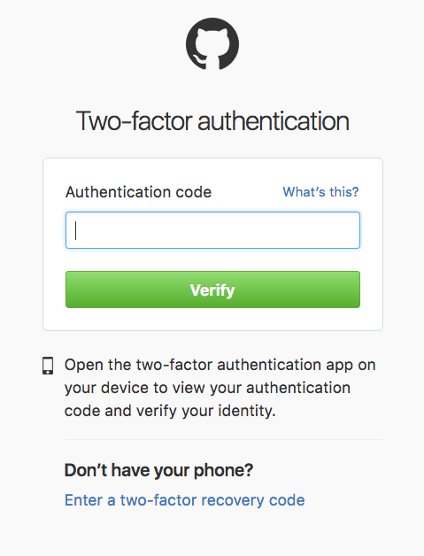

# What is two-factor authentication?

### What is two-factor authentication?

- Also known as 2FA and TFA

- It is a type of 'multi factor authentication' that requires not only a password and username but
also something that only, and only, that user has on them. An example of this would be google's 2FA process
for user login where they send you a code via SMS.


This google user authentication is a great example of a **Time-based One-time Password Algorithm** (TOTP).
The Time-based One-time Password Algorithm is an algorithm that computes a one-time password from a shared secret key and the current time.

#### Two-factor authentication on GitHub

GitHub supports two-stage authentication to login to your account.

1. Set up two-stage authentication in the security section of your GitHub settings.


2. There are two options, via SMS an app.


3. Download an authentication app. Interestingly the apps are all third party apps and not provided by GitHub.


4. Once set up, every time you open the application it provides you with a authentication code (TOTP).


5. After you insert your username and password you will be asked for the authentication code.


6. You are now logged in! 

All the of steps to set up two-stage authentication can be found [here](https://help.github.com/articles/configuring-two-factor-authentication-via-a-totp-mobile-app/ "GitHub 2FA setup step-by-step")

Finally - with node modules like [speakeasy](https://github.com/speakeasyjs/speakeasy) you can use two-stage authentication on your
projects with Google Authenticator!

# What are the benefits of oAuth?
# How do you write tests for an Authenticated endpoint?

# How and why we hash passwords

If we want to allow your users to log in without using OAuth we will need to store a password in a database so that they can identify themselves.

If we store the passwords in clear text, any attacker gaining access to the database will also get all of the passwords. Anyone with a user's password will be ableto access to their personal information, probably across multiple websites. Databases get hacked regularly (I highly recommend signing up to [have I been pwned?](https://haveibeenpwned.com/)) and so we must hide the passwords in a way that still allows us to compare them against what the use submits as log in details.

## Hashing vs Encryption

Don't encrypt passwords. Though secure when encrypted, the passwords can be decrypted with the encryption key. OUr program will need to save it somewhere in order to use it, so we are vulnerable to an attack stealing the encryption key and decrypting all the passwords.

Instead we should 'hash' passwords. Hashing is similar to encryption except that it is a one-way process and does not require a secret key. Each time we give a hash function the same input we get the same output. But we can't use the output to calculate the input. For example: `15 % 10` will always be 5. But if we have `n % 10 = 5` we can't work out what n is, because there are infinite possibilities (5, 15, 25...).

### Salting

Because a hash function will always give the same output for the same input an attacker with access to a database of hashed passwords could try hashing lots of possible passwords and seeing if the hashed output matches any of the hashed passwords. Precomputed lists of hashes (called 'hash tables') exist so an attacker doesn't even need to do the computation themselves.

To defend against this we should use 'salting'. We append a unique random string (known as the 'salt') to the password before hashing it. The addition of the salt changes the output hash. Hash tables are therefore no longer useful for attackers because the hashes they contain are for passwords without any additional salt.

Of course, if we are to test a user-submitted password against the one stored in the database we need to know the salt so we can add it to the submitted password before hashing. We can store the salt in clear text alongside the password in the database. It is not a problem that an attacker with access to the database could see it, because they'd need to compute the hash of every possible password plus the salt to make any use of it.

The effect of salting is to greatly increase the attacker's computation requirements because for each password in the database they need to calculate the hashes of all possible passwords plus the salt until they find a match. Plus, if each salt is unique then two identical passwords will be stored as different hashes because their salts will differ.

Another defensive technique is to add a 'work factor' to the hashing to make the computation harder and so slower. The aim is to make the computation seem quick to the user but slow enough (e.g. 0.5s) that trying to compute billions of possible passwords becomes unfeasibly slow even with very fast computers.

# To do all this safely

Use `bcrypt`. It will handle all of the above for you and will be much more robust than doing it yourself.

```javascript
const bcrypt = require('bcrypt');
const SALT_WORK_FACTOR = 10; // <-- minimum is 1, higher means slower

/* To prepare a clear text password to be stored in a database */
const encrypt = (password, callback) => {
    bcrypt.genSalt(SALT_WORK_FACTOR, (err, salt) => {
        if(err) {
          return callback(err);
        }
        bcrypt.hash(password, salt, (err, hash) => {
            if(err) {
              return callback(err);
            }
            callback(null, hash); // <-- contains the hash of the password + salt. Can be inserted into DB now.
        });
    });
};

/* 'candidatePassword' is the clear text password submitted by the user when logging in.
 * 'storedPassword' is the salted and hashed value stored in the database.
 * bcrypt will make sure the candidatePassword is correctly hashed (and salted if need be) before
 * making the comparison */
const comparePassword = (candidatePassword, storedPassword, callback) => {
    bcrypt.compare(candidatePassword, storedPassword, (err, isMatch) => {
        if(err) {
          return callback(err);
        }
        callback(null, isMatch);
    });
};

```
# See

http://security.stackexchange.com/questions/36833/why-should-i-hash-passwords
http://security.stackexchange.com/questions/66989/how-does-a-random-salt-work
http://security.stackexchange.com/questions/211/how-to-securely-hash-passwords/31846#31846
https://crackstation.net/hashing-security.htm