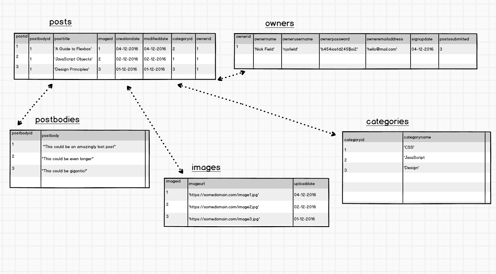
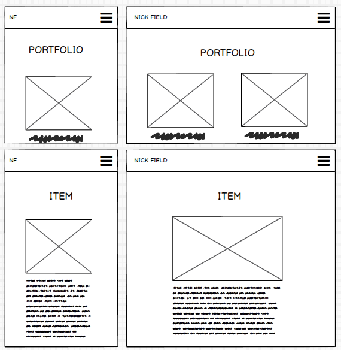
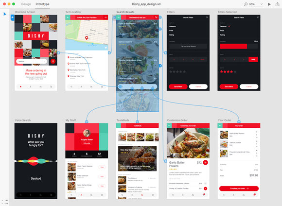

# Why use wireframes and prototypes?

# What is a wireframe

A wireframe is a very simple mock up of a website, it is a visual guide of a skeletal frame of a website.
Wireframes are often one of the first steps in designing a website.

## How do developers and designers make wireframes

Developers may use wireframes to get a more tangible grasp of the site's functionality.

Designers use wireframes to push the user interface process.

## High Fidelity vs Low Fidelity wireframe

There are numerous libraries that contain common UI elements, which can allow a designer to quickly and easily create example designs that are relatively closer in appearance to a finished product than a traditional wireframe would be.

High Fidelity Wireframes can be more persuasive for clients and stakeholders, as they give a better sense of how an app will actually look. On the other hand by giving the appearance of being finished they may dissuade people from suggesting significant changes that would lead to a better product.

## General considerations when designing a high/low fidelity wireframe
- Design in black and white (don't distract team/clients with early colour choices).
- You can use existing templates to start with. Search for some  [here](https://creately.com/diagram-community/examples/t/wireframe)
- Use different shades of grey to highlight buttons, components and text.
- If designing a high fidelity wireframe from scratch, first build a grid, then start by building largest elements (e.g. page/components) and gradually layer smaller components (e.g. buttons).

### Resources
[Useful tool to see websites in simplified wireframe format](http://www.wirify.com)  
[Collection of wireframe resources](http://wireframes.tumblr.com/)  
[Online Wireframe Builder](https://wireframe.cc/)  
[Balsamiq](www.balsamiq.com/)  

# Prototyping

It’s easier to use an eraser on the drafting board, than a sledgehammer at the construction site.
– Frank Lloyd Wright

By building a practical, preliminary version of your product, you will catch potential problems and promising insights faster and earlier in the process. A prototype gives you the ability to test a product through interaction in a way that a mockup can't. 

[The Playme prototype](https://www.justinmind.com/usernote/tests/4/1765/11588699/index.html#/screens/b107c292-d618-44ed-92b9-c0e4c8f26e0b)

Prototyping is the stage after wireframing. It's meant to be a near-accurate, interactive representation of the final website. It represents enough of the appearance and function of the product that it can be used for user research.

It should allow the user to:

* experience content and interactions with the interface

*  test the main interactions in a way similar to the final site

With a prototype you should be able to move through the website's user stories and check how well things flow. The intention is to get a good idea of how the actual website will work in practice. Unlike wireframes, the prototype should look pretty like the end result, although you don't need to link up things like backend code.

There are a collection of app prototypes [here](https://www.justinmind.com/examples). Note how they look similar to a complete app and how you can move through the different sections of the projects.

### Final thought
So what is a prototype? 
It’s a simulation of the final product. It’s like an interactive mockup that can have any degree of fidelity. The main purpose of building prototypes is to test whether or not the flow of the product is smooth and consistent.

Designer Kazuyuki Motoyama explains that the only way to actually know what a Miiverse would feel like was to hold it. That’s when he built this prototype out of cardboard.

## Resources

http://alistapart.com/article/sketchingincode
https://blog.prototypr.io/the-7-best-prototyping-tools-for-ui-and-ux-designers-in-2016-701263ae65e8#.ae86b1bel
