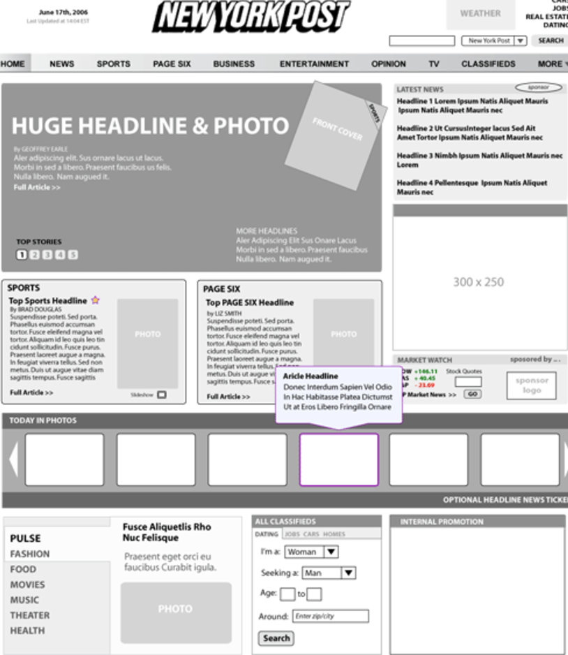

# What is a wireframe

A wireframe is a very simple mock up of a website, it is a visual guide of a skeletal frame of a website.
Wireframes are often one of the first steps in designing a website.

## How do developers and designers make wireframes

Developers may use wireframes to get a more tangible grasp of the site's functionality.

Designers use wireframes to push the user interface process.

## High Fidelity vs Low Fidelity wireframe

There are numerous libraries that contain common UI elements, which can allow a designer to quickly and easily create example designs that are relatively closer in appearance to a finished product than a traditional wireframe would be.

High Fidelity Wireframes can be more persuasive for clients and stakeholders, as they give a better sense of how an app will actually look. On the other hand by giving the appearance of being finished they may dissuade people from suggesting significant changes that would lead to a better product.

## General considerations when designing a high/low fidelity wireframe
- Design in black and white (don't distract team/clients with early colour choices).
- You can use existing templates to start with. Search for some  [here](https://creately.com/diagram-community/examples/t/wireframe)
- Use different shades of grey to highlight buttons, components and text.
- If designing a high fidelity wireframe from scratch, first build a grid, then start by building largest elements (e.g. page/components) and gradually layer smaller components (e.g. buttons).

### Resources
[Useful tool to see websites in simplified wireframe format](http://www.wirify.com)  
[Collection of wireframe resources](http://wireframes.tumblr.com/)  
[Online Wireframe Builder](https://wireframe.cc/)  
[Balsamiq](www.balsamiq.com/)  

# What is a prototype
