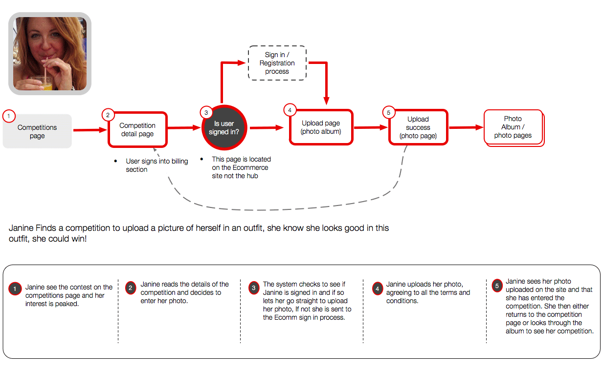

# User Journeys and Stories

## What is the difference between a Journey and a Story?

### User Story

This is a short, simple description of a feature told from the perspective of the person who desires the new capability, usually a user or customer of the system.
User stories work well for the product **functionality**.

It typically follows a simple template:

```
“**As a** ‘type of user’,
 **I want** ‘some goal’
 **so that** ‘some reason’.”
```


### User Journey

A user journey is a series of steps (typically 4-12) which represent a scenario in which a user might interact with the thing you are designing. They can be used for 2 main things:

* Demonstrating the way users **currently** interact with the service / website / product
* Demonstrating the way users **could** interact with the service / website / product



### How a User Story is Different from a User Journey

This does depend on the context of its usage but a User Story is based on a specific user, so this could cater for a particular type of user to answer a specific problem whereas a User Journey can be a random user that may use the web app.

**Note: Based on context, a User Journey and Story can be one and the same.**

### References
1. [10 tips for writing good user stories](http://www.romanpichler.com/blog/10-tips-writing-good-user-stories/)
2.  [User Stories – The Beginner's Guide](http://theuxreview.co.uk/user-stories-the-beginners-guide/)
3. [User Journeys Beginner's Guide](http://theuxreview.co.uk/user-journeys-beginners-guide/)
4. [UX The Difference between User Journey and User Story](http://www.i3lance.co.uk/2015/02/the-difference-between-storyboard-and-user-journey-and-user-story/)

## Jobs To Be Done (JTBD)

### What is JTBD?

JTBD is a task-centred framework for designing user experiences. It is an alternative to the customer-focused framework of personas, user journeys and user stories. One of its key concepts is that people 'hire' products to do jobs in their lives.

Customer-focused frameworks rely on the premise that demographic details and personas inform people's purchasing behaviours. However, this is not necessarily the case. Someone's demographic attributes often do not explain why they choose to purchase or use a particular product.

### How is JTBD implemented?

In a customer-focused framework, a user story will be in the following format:

> As a [persona/role] I want to [action] so that [outcome/benefit].

In contrast, the JTBD framework would use a job story in the following format:

> When [users work/life context] I want to [motivation] so that [outcome/benefit].

This subtle shift moves attention away from demographic details, and instead places the focus on the specific task being performed.

Instead of approaching your design in terms of user journeys that address user stories, you would consider the _job_ journeys that would allow users to achieve each of the product's _job stories_.

As JTBD is only interested in the 'why' and 'what' of a task, there is no need for personas (the 'who').
