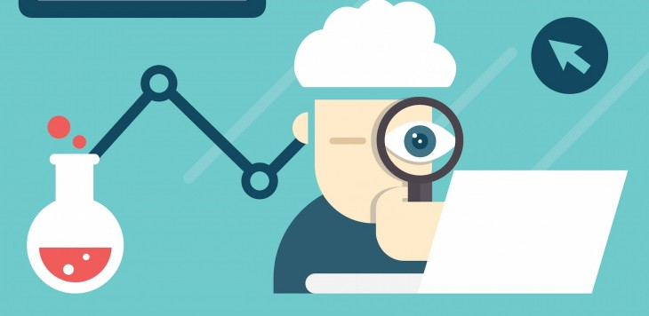

# User testing

[Your website should be so simple, a drunk person could use it.](http://theuserisdrunk.com/)

## What

__User testing__ is the assessment of the usability of your app or website by testing it with real users.

User testing is not the same as __market research__, which is a form of collecting opinions. It informs the early stages of development by assessing the validity of the target audience, the underlying business model and the level of competition.

User testing includes the following five components:  

- __Learnability__: How easy is it for users to accomplish basic tasks the first time they encounter the design?  
- __Efficiency__: How fast can experienced users accomplish tasks?  
- __Memorability__: When users return to the design after a period of not using it, does the user remember enough to use it effectively the next time, or does the user have to start over again learning everything?  
- __Errors__: How many errors do users make, how severe are these errors and how easily can they recover from the errors?  
- __Emotional response__: How does the user feel about using the product? Would they recommend it to a friend?

## Why

Because usability is the most important aspect of a user-centered product!

User testing:
- identifies any usability problems  
  - _40% of users abandon the website if it takes more than 3 seconds to load_
- determines user satisfaction
- provides you the knowledge to make your product more desirable (and beat the competition!)
- reduces development costs, if done in an agile way *
  - _50% of engineering time is spent on rework that could be avoided_

\* In a typical waterfall flow, the high-level test planning and the writing of the test cases are done after the completion of the project by the QA (quality assurance) personnel. In contrast, in a typical agile project the testing is much more integrated and is done throughout the project. As a result, potential problems are diagnosed and fixed early on in the development process, reducing the costs.

## How?

What type of user testing technique works best for you?

### Focus groups testing:

User testing that allow you watch and interview real users while they interact with a product or service.

Focus groups allow you to deeply and extensively see a group of users interacting with each other to discuss an idea or concept. This can spark some great inspiration as you will gain more insight from the ideas of the group.

### Tree Testing:

It allows you to see how well users interact and find items or elements in the website hierarchy.

If the content isn’t structured logically with a simple flow, it might as well not exist. That’s why an early tree test can help identify and solve the problems before they actually become problems.

A basic paper-print approach can work for this, but now there are softwares available for tree testing as well.

### Remote User testing:

Remote testing is the most efficient because it can be implemented throughout the whole process of development – from concept to post deployment.

Pro: budget
Con: the user’s thought process when using a product or service – might not come through as much as when using in-person methods.

### Hallway Testing:

“A hallway usability test is where you grab the next person that passes by in the hallway and force them to try to use the code you just wrote. If you do this to five people, you will learn 95 percent of what there is to learn about usability problems in your code.”

Of course you don’t need to literally grab people from the hallway, but the idea is that any small number of random users (from within your target audience) will give you a sufficient amount of data for your usability goals.

The test itself doesn’t have to be that complex. Corinna Baldauf, Web Developer and UX Blogger, suggests setting up a station with your product in a public venue — she used an office break room, while others suggest Starbucks. When someone comes by, ask them to test the system, perhaps even adding some incentive (don’t underestimate the power of chocolate). Give them instructions, then step back and watch. Don’t forget to take notes, particularly on what is not going as expected

### Beta-testing:

Beta testing is helpful if you:

- Already built a feature and want to ship it to a subset of your users to gather feedback, questions and bugs from different sources and personas.
- Have a specific question you want to answer about a live feature in order to make informed changes.
- Want to have many people using it immediately.
- Want to track usage and adoption rates in a subset of your whole customer base.

### User Diaries testing:

Involve real users when testing. No amount of tools or test cases can substitute for real life testing with real users.

Ultimately, they more likely to catch the key usability issues.

## Quantitative vs. Qualitative data

## General tips for user testing:

- Know When To Test & What To Test.
- Ask the Right Questions.
- Consider Test Length.
- Avoid Unnatural Test Flows.
- Identify Problems and Hypothesize Fixes.
