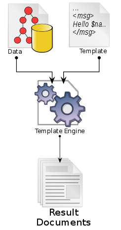

## Templating

### What is a templating engine and why would you use it?

#### Template engine

- software designed to combine one or more templates with a data model to produce one or more result documents,
- a main purpose is to process templates and data to output text.

A diagram illustrating all of the basic elements and processing flow of a template engine:




#### Benefits of using template engines
 - encourages good code organization (**separate model (= logic)** and **view (= presentation)**),
 - reusable templates,
 - provides a more elegant way to create dynamic DOM elements (client-side).

### What is Handlebars.js? (group1)

- One of the most popular JavaScript templating engines
- Not specific to Hapi or Node.js, can be used for any JS templating
- Builds on top of Mustache templating engine
- In Hapi, handlebars can be used as the engine for rendering `html` templates

As in Mustache, handlebars templates look like regular HTML, with embedded placeholders (e.g. `{{expression}}`).

``` html
<body>
  <h1>{{title}}</h1>
  <section>
    {{introduction}}
  </section>
</div>
```

In Hapi, parameters that are provided by the client request are available in the `query` object.

``` html
<div>{{query.paramName}}</div>
```

Handlebars provides additional helpers (functions used within templates), such as:
- `{{#with}}` helper takes an object and then allows you to refer to its properties
- `{{#each}}` helper allows you to loop through an object's properties

To implement custom helpers, these can be provided a in separate `js` file and exported using `module.exports`. The name of each helper file will be used as the helper name in the template.

When configuring `server.views`, the `helpersPath` property is used to let Hapi know where to find our custom handlebars helpers.

### Example walkthrough... (group 2 does this)

### Additional - What are the advantages of using server side rendering vs rendering dynamic content on the client? (group 1)

### Additional -  How would you use Hapi's views interface to serve dynamic content? (real life example) (group 1)

### Resources
- [Template engines](http://www.wikiwand.com/en/Template_processor#/Template_engine_2)
- [Model-View concept](http://www.simple-is-better.org/template/)
- [The top 5 JavaScript templating engines](http://www.creativebloq.com/web-design/templating-engines-9134396)
- [Hapi — Create and Use Custom Handlebars Helpers](https://futurestud.io/tutorials/how-to-create-and-use-custom-handlebars-helpers-with-hapi)

### Example

- examples of view engines (e.g. jade, handlebars. esx etc)
- Vision adds view methods
- The views method is used to configure
- Views takes a single argument with is object containing engines key which is itself an object- a mapping of file extensions to view engines (e.g. 'html: require('handlebars')... ') hbs?.
- Views needs a path of where to find views, 'relateTo: "__dirname"' (directory of where views located), and path, which is relative to the directory (e.g. views).
- All of these steps are rquired before adding routes to serve the views
- inside the handler, the view method is added to the reply object ()
- view takes a first name as the view method (e.g. home, no need for home.html if view engine set for html).
- HBS files use {{ }} syntax...
- optional path parameters can be added in the path . e.g. '/{name?}', the name parameter will be available in the params object in the request object.
- reply.view('home', { name: request.params.name || world, }).
- By setting layout to true, you can create a layout file (e.g. layout.hbs), which uses {{{content}}} as the placeholder view
